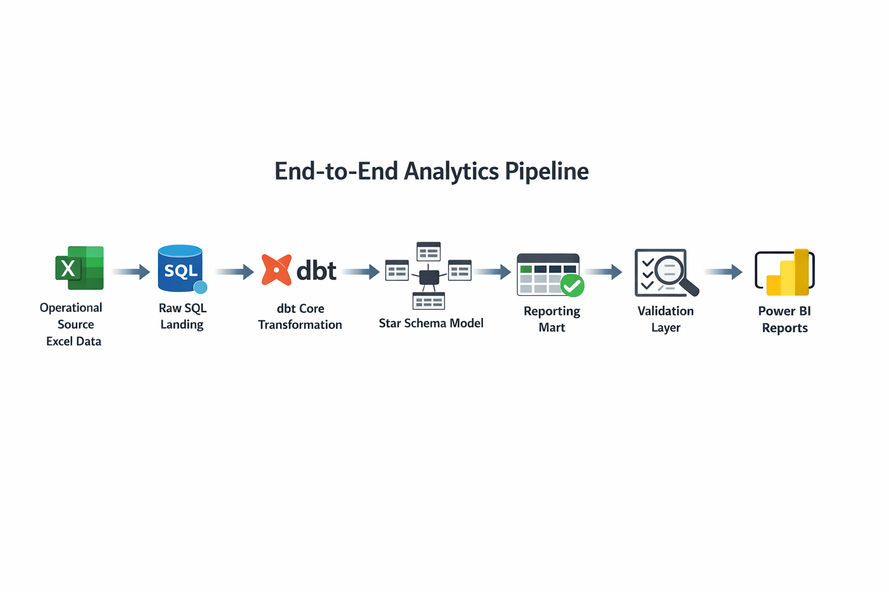

# Private Markets Analytics Pipeline

End-to-end analytics engineering pipeline for a synthetic private markets dataset (PE Buyout, PE Growth, PE Infrastructure, Private Debt, Real Estate). Source workbook → SQL Server raw landing → dbt core (staging → intermediate → star schema → mart) → Power BI.

Independent portfolio project. The dataset is idealised but economically coherent: clean J curves, validated DPI / RVPI / TVPI ratios, full TVPI = DPI + RVPI identity, and a proper Kimball-style dimensional backbone.



## Tech stack

| Layer            | Tool                              |
| ---------------- | --------------------------------- |
| Source workbook  | Excel (10 operational tabs)       |
| Raw landing      | SQL Server 2022, BULK INSERT      |
| Transformation   | dbt core 1.x with `dbt-sqlserver` adapter |
| Modelling        | Star schema (3 dims + 3 facts) on SQL Server |
| Reporting        | Power BI Desktop                  |
| Reporting currency | CHF (Swiss Franc, with daily FX rates against base currencies) |

## Architecture in one paragraph

The Excel workbook is treated as the OLTP source system. Ten tabs are exported as CSV, bulk-loaded into the `raw` schema, then transformed in dbt core through `staging` (snake_case + type-safe rebuild) → `intermediate` (joins + cumulative cashflow / IRR-input shaping) → `mart` (3 conformed dimensions, 3 facts, and one reporting view). The reporting mart `mart.mart_fund_quarterly_performance` carries DPI / RVPI / TVPI in CHF on top of the dimensional backbone. A Power BI semantic layer reads from the mart for fund scorecards and J-curve visuals.

5 funds × ~24-40 quarterly snapshots each give enough density for smooth J curves and ratio trends without over-building.

## Folder map

```
GitHub_Private_Markets_Analytics/
├── README.md                                                 ← this file
├── .gitignore
│
├── dbt_private_markets/                                      The dbt core project
│   ├── dbt_project.yml
│   ├── profiles.example.yml                                  ← copy to ~/.dbt/profiles.yml and edit server name
│   ├── .gitignore                                            (target/ logs/ dbt_packages/)
│   ├── analyses/legacy/
│   │   └── mart_fund_quarterly_performance_legacy.sql        (pre-STAR-correction, kept for reference)
│   ├── macros/
│   │   └── generate_schema_name.sql                          (forces exact schema names, prevents staging_staging concatenation)
│   ├── models/
│   │   ├── staging/                                          (3 models — stg_funds, stg_cashflows, stg_nav)
│   │   ├── intermediate/                                     (4 models — fund cashflows, cumulative, performance snapshots, IRR inputs)
│   │   └── mart/
│   │       ├── dimensions/                                   (3 dims — dim_fund, dim_date, dim_investor)
│   │       ├── facts/                                        (3 facts — fact_cashflows, fact_nav, fact_commitments)
│   │       └── mart_fund_quarterly_performance.sql           (final reporting view)
│   ├── seeds/, snapshots/, tests/                            (empty placeholders, .gitkeep'd)
│
├── ELT_via_SSMS_sql_server_scripts_pre_and_post_DataModeling/    Active pipeline SQL (run in SSMS)
│   ├── 01_platform_setup/                                    (1 script — DB + 4 schemas)
│   ├── 02_raw_landing/                                       (3 scripts — create + load + validate)
│   └── 03_post_model_validation/                             (7 scripts — sanity checks after dbt run)
│
├── OLTP_SourceDataset_as_xlsx_csv/                           Source dataset
│   ├── csv/                                                  10 source CSVs (BULK INSERT'd into the raw schema)
│   └── xlsx/
│       ├── Fund_Subscription_Wide_and_Star_Schema.xlsx
│       └── private_markets_crystallized_v7_chf_fixed.xlsx    (the source-of-truth workbook)
│
├── PitchbookDeck_and_deliverables/                           Portfolio deliverables
│   ├── Private_Markets_Analytics_Pipeline.pptx               (the portfolio deck — editable source)
│   ├── Private_Markets_Analytics_Pipeline.pdf                (the portfolio deck — shareable PDF export)
│   └── SELF_STUDY_GUIDE.md                                   (full project teaching reference — same model as the BIS sister project)
│
└── images_and_screenshots_ForDeck/                           Architecture + star schema diagrams
    ├── end_to_end_analytics_pipeline.png
    ├── powerbi_star_schema.jpg
    ├── powerbi_star_schema_2.jpg
    ├── powerbi_star_schema_relationships.jpg
    └── sql_server_2022_database_diagram.jpg
```

## Setup (running locally)

1. **Install prerequisites.**
   - SQL Server 2022 (Express edition is fine) + SSMS
   - Python 3.11+
   - `pip install dbt-core dbt-sqlserver`
2. **Configure dbt.** Copy `dbt_private_markets/profiles.example.yml` to `~/.dbt/profiles.yml` (Windows: `C:\Users\<you>\.dbt\profiles.yml`). Edit the `server` line for your instance.
3. **Build the database.** In SSMS, run `ELT_via_SSMS_sql_server_scripts_pre_and_post_DataModeling/01_platform_setup/01_create_database_and_all_core_schemas.sql`.
4. **Update the BULK INSERT paths.** Open `ELT_via_SSMS_sql_server_scripts_pre_and_post_DataModeling/02_raw_landing/02_load_raw_tables_from_csv.sql` and update each `FROM` path to point at this clone's `OLTP_SourceDataset_as_xlsx_csv/csv/` folder (SQL Server's BULK INSERT requires absolute paths and the SQL Server service account needs read access).
5. **Load raw.** In `ELT_via_SSMS_sql_server_scripts_pre_and_post_DataModeling/02_raw_landing/`, run in order: `01_create_raw_tables.sql` → `02_load_raw_tables_from_csv.sql` → `03_validate_raw_load.sql`. Expect these row counts: funds 5, investors 11, commitments 55, cashflows 927, nav 156, date_dim 3653, asset_master 30, asset_quarterly_snapshot 765, fx_rates_chf 18265, investor_cashflows 10004.
6. **Run dbt.** From the `dbt_private_markets/` folder:
   ```
   dbt debug
   dbt run
   dbt test
   ```
   Expected: all models build cleanly. The `mart` schema ends up with 3 dim tables, 3 fact tables, and 1 mart view.
7. **Validate the marts.** Run the 7 scripts in `ELT_via_SSMS_sql_server_scripts_pre_and_post_DataModeling/03_post_model_validation/` in numeric order. Script `06` (full precision) and `07` (2-decimal display) are two flavours of the same preview.
8. **Open Power BI** (the `.pbix` files are not committed to this repo — see `PitchbookDeck_and_deliverables/Private_Markets_Analytics_Pipeline.pptx` or its `.pdf` counterpart for screenshots of the report pages). Refresh the local `.pbix` against the rebuilt `mart.mart_fund_quarterly_performance` if you have it.

## Validated outputs

After a clean run the latest snapshot per fund (CHF, 2 decimals) reproduces:

| Fund                   | DPI   | RVPI  | TVPI  |
| ---------------------- | ----- | ----- | ----- |
| Alpha Buyout I         | 1.062 | 0.280 | 1.342 |
| Beta Growth II         | 0.537 | 1.005 | 1.542 |
| Gamma Infra I          | 0.232 | 0.949 | 1.181 |
| Delta Direct Lending I | 0.740 | 0.317 | 1.057 |
| Epsilon Real Estate I  | 0.526 | 0.589 | 1.114 |

The `TVPI = DPI + RVPI` identity holds across all rows.

## Documentation

The repo includes one extended document in `PitchbookDeck_and_deliverables/`:

- **`SELF_STUDY_GUIDE.md`** — full project teaching reference walking through the pipeline end-to-end: project overview, tools, architecture vs production, data format flow, star schema design, SQL function reference, every dbt model with purpose / grain / source / output schema, business metrics rationale, end-to-end recipe, lexique. Same structure as the BIS sister project's self-study guide. An HTML rendering (`SELF_STUDY_GUIDE.html`) is also included for browser viewing.

## Sister project

[`gny-analytics/BIS_Analytics_Pipeline`](https://github.com/gny-analytics/BIS_Analytics_Pipeline) — companion BIS reserve analytics pipeline on Microsoft Fabric + dbt-fabric + OneLake. Same paradigm, different platform.

---

*Independent portfolio project. Synthetic data only — no proprietary information from any prior employer.*
